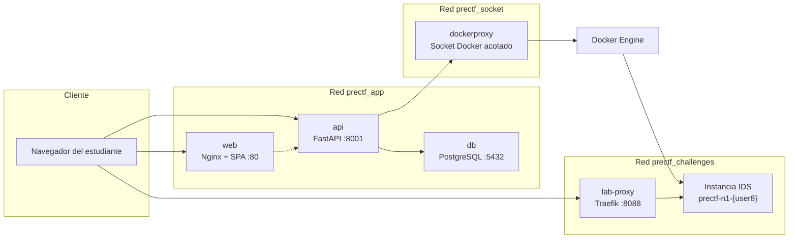

# preCTF UCC — Documentación para auditoría y transferencia

**Software:** preCTF UCC  
**Versión de la API:** 1.1.0  
**Institución:** Universidad Cooperativa de Colombia, sede Ibagué  
**Área:** Ingeniería de sistemas — ciberseguridad aplicada  
**Tipo:** Plataforma web educativa (SPA + API REST), no es un producto comercial  
**Repositorio compañero:** laboratorio competitivo [CTF UCC](../../CTF%20ucc/) (`D:\juandmm1233\CTF ucc`)

Este documento describe el **caso de estudio**, la **arquitectura** y las **tecnologías** del software. Está pensado para auditores, docentes y personas que deban operar o evolucionar el sistema sin haber participado en su desarrollo.

Presentación visual complementaria: [`arquitectura.html`](arquitectura.html).

---

## 1. Caso de estudio

### 1.1 Contexto académico

El programa de Ingeniería de Sistemas de la UCC (Ibagué) incluye una sesión práctica **Attack & Defend** (formato 15 vs 15, aproximadamente 3 horas). En esa sesión los estudiantes operan dos laboratorios web intencionalmente vulnerables — Ibagué Data Services (IDS) y UCC Web Services (UWS) — mientras atacan el sistema del equipo rival y defienden el propio.

Ese laboratorio competitivo (repositorio **CTF UCC**) es exigente: asume que el estudiante ya reconoce vectores web clásicos (inyección SQL, manipulación de cookies, LFI, fuga de configuración, inyección de comandos, hashes débiles, carga insegura de archivos y credenciales SSH débiles). Llevar a 30 estudiantes directo a esa sesión, sin un recorrido guiado, produce dos fallos pedagógicos:

1. Una parte del grupo no identifica los vectores y queda fuera del ejercicio.
2. Otra parte copia procedimientos ofensivos sin entender *por qué* el defecto existe ni cómo se mitiga.

**preCTF** es la respuesta de software a ese problema: un **campo de entrenamiento secuencial** que se usa *antes* de la clase competitiva.

### 1.2 Problema que resuelve el software

| Dimensión | Situación anterior | Situación con preCTF |
|-----------|--------------------|----------------------|
| Progresión | Todos los vectores a la vez, en red abierta | 8 niveles en orden; el siguiente se desbloquea solo con la flag correcta |
| Aislamiento | Un laboratorio compartido o VMs de clase | Una instancia de entrenamiento por estudiante, con TTL y tope de sesiones |
| Evaluación | Puntaje competitivo (scoreboard 15v15) | Progreso individual, pistas con costo, certificado y token de acceso |
| Material ofensivo | Playbooks del lab competitivo | Tutoriales conceptuales en Markdown; **sin payloads ni PoCs** en este repo |
| Flags | Banderas de la clase (`FLAG{UCC_*}`) | Banderas de entrenamiento (`FLAG{PRECTF_N*}`), distintas y rotables |

### 1.3 Objetivos del sistema

1. Registrar estudiantes (correo + código) e instructores.
2. Presentar 8 niveles pedagógicos alineados con los vectores del laboratorio CTF UCC.
3. Orquestar, para los niveles web, una **instancia aislada** del laboratorio de entrenamiento (imagen construida desde `ctf1`, sin copiar el código vulnerable a este repositorio).
4. Validar flags por hash (SHA-256); nunca devolver el texto plano al cliente.
5. Penalizar flags trampa (honeypots) sin revelar su existencia en la API de progreso.
6. Al completar el nivel 8, emitir un **token de acceso** `PRECTF-UCC-…` que el instructor puede verificar antes de admitir al estudiante en el CTF práctico.

### 1.4 Actores

| Actor | Rol en el software |
|-------|-------------------|
| Estudiante | Se registra, inicia lecciones, practica en el lab aislado, envía flags, consulta pistas y obtiene certificado/token |
| Instructor | Cuenta administrativa; verifica tokens (`X-Instructor-Key` o JWT admin); rota flags; publica la imagen del lab |
| Auditor / mantenedor | Revisa este documento, el código de la plataforma y el repositorio CTF UCC como conjunto |

### 1.5 Alcance explícito (qué es y qué no es)

**Es:** un portal de autenticación, progresión y orquestación de laboratorios didácticos.

**No es:**

- Un CTF competitivo embebido (el marcador 15v15 vive en CTF UCC).
- Un repositorio de exploits, payloads o playbooks ofensivos.
- Una copia de `ctf1/` o `ctf2/` (el código vulnerable **no vive aquí**).
- Un sistema de producción con TLS, alta disponibilidad o cumplimiento PCI/ISO por defecto.

Las vulnerabilidades que el estudiante explora están en la **imagen de laboratorio** construida desde CTF UCC, no en la API ni en la SPA de preCTF.

### 1.6 Relación pedagógica con CTF UCC

```
Fase 1 — preCTF (individual, secuencial)
    Estudiante → 8 niveles → token PRECTF-UCC-…
                         ↓
Fase 2 — CTF UCC (equipos, Attack & Defend)
    Equipo IDS (VM1)  vs  Equipo UWS (VM2)  +  Scoreboard (VM3)
```

Los ocho niveles de preCTF mapean uno a uno a los vectores del laboratorio (CSRF del lab original es bonus **sin flag** en el scoreboard y **no** forma parte de los 8 niveles). XSS no está en el laboratorio actual.

| Nivel | Vector (concepto) | Recurso de práctica | Puntos |
|------:|-------------------|---------------------|-------:|
| 1 | Inyección SQL | `/index.php` | 50 |
| 2 | Manipulación de cookie / control de acceso | `/admin.php` | 75 |
| 3 | LFI / path traversal | `/download.php` | 60 |
| 4 | Fuga de configuración | `download.php` + `config/app.ini` | 70 |
| 5 | Inyección de comandos | `/network.php` | 80 |
| 6 | Hash débil (MD5) | tabla `secrets` | 100 |
| 7 | Carga insegura de archivos | `/upload.php` | 120 |
| 8 | Credenciales SSH débiles | contenedor `db_ssh` del lab de clase | 150 |

Los niveles 1–7 se practican en **la misma instancia** IDS (distintas rutas PHP). El nivel 8 se resuelve en el laboratorio de clase (SSH), no en el contenedor de entrenamiento web.

### 1.7 Restricciones de diseño relevantes para auditoría

- **Separación de secretos:** las flags de entrenamiento deben ser distintas de las de la sesión 15v15.
- **No duplicar código vulnerable:** Compose construye `challenge-n1` con contexto externo `CTF_LAB_N1_CONTEXT` (por defecto `../CTF ucc/ctf1`).
- **Aislamiento de red:** los labs no alcanzan PostgreSQL ni el socket de Docker.
- **Límite operativo de aula:** tope de sesiones simultáneas (`PRECTF_MAX_LAB_SESSIONS`, 20) y TTL (`LAB_TTL_MINUTES`, 45).
- **Rate limit** de envío de flags: 30 por minuto y estudiante.

---

## 2. Arquitectura

### 2.1 Tipo de aplicación

Aplicación web de **tres capas**, desplegada con Docker Compose:

1. **Cliente:** SPA (React) servida por Nginx.
2. **Servidor de aplicación:** API REST (FastAPI + Uvicorn).
3. **Datos y orquestación:** PostgreSQL 16; Docker Engine (vía proxy acotado) + Traefik para labs.

Estilo de integración: **REST JSON** con JWT de 12 horas. No hay SOAP, GraphQL ni bus de mensajes.

### 2.2 Vista de componentes



El navegador habla con la UI y con `/api`. El laboratorio **no** se sirve a través de la API: el estudiante abre `http://n1-{8hex}.localhost:8088/{ruta}` y Traefik enruta al contenedor de ese estudiante.

### 2.3 Servicios Compose

| Servicio | Imagen / build | Puerto host | Función |
|----------|----------------|-------------|---------|
| `web` | `frontend/` → Node 22 (build) + Nginx 1.27 | 80 | SPA estática; no ejecuta lógica de negocio |
| `api` | `backend/` → Python 3.12-slim | 8001 → 8000 | Auth, progreso, flags, orquestación, admin |
| `db` | `postgres:16-alpine` | 5432 | Estado persistente de la plataforma |
| `dockerproxy` | `tecnativa/docker-socket-proxy:0.2.0` | interno 2375 | Única vía de la API hacia el Engine |
| `lab-proxy` | `traefik:v3.3` (file provider) | 8088 → 80 | Hosts `n1-{hex}.localhost` hacia cada lab |
| `challenge-n1` | perfil `build-labs` | — | Solo construye la imagen; no queda corriendo |

### 2.4 Tres redes (aislamiento)

| Red | Quién está | Para qué |
|-----|------------|----------|
| `prectf_app` | web, api, db | Tráfico de la plataforma |
| `prectf_socket` | api, dockerproxy | Control de contenedores **sin** montar el socket crudo en la API |
| `prectf_challenges` | lab-proxy e instancias | Labs aislados: no ven PostgreSQL ni Docker |

En el proxy de socket están **deshabilitados** BUILD, EXEC, VOLUMES, AUTH, SECRETS y operaciones Swarm. La API solo puede listar/crear/eliminar contenedores e imágenes en el alcance necesario.

### 2.5 Flujo de un estudiante

1. Registro o login → `POST /api/auth/register` o `/login` → JWT en el cliente.
2. Dashboard → `GET /api/dashboard` → estados `locked | available | completed`.
3. Iniciar lección → `POST /api/levels/{id}/environment/start` → contenedor `prectf-n1-{user8}` + ruta Traefik (se reutiliza en N1–N7).
4. Práctica en el navegador contra Traefik (`:8088`).
5. Envío de flag → `POST /api/levels/{id}/submit` → desbloqueo del siguiente nivel o penalización honeypot.
6. Al completar N8 → token `PRECTF-UCC-{año}-{user8}-{nonce}.{hmac}` y pantalla de certificado.

Un bucle en el *lifespan* de FastAPI, cada 60 s, reapertura/limpia sesiones de lab caducadas.

### 2.6 API principal

| Método | Ruta | Descripción |
|--------|------|-------------|
| GET | `/api/health` | Salud del proceso (sin auth) |
| POST | `/api/auth/register` | Alta de estudiante |
| POST | `/api/auth/login` | JWT (email o código) |
| GET | `/api/dashboard` | Progreso y token si aplica |
| GET | `/api/levels/{id}` | Detalle + Markdown conceptual + estado del lab |
| POST | `/api/levels/{id}/submit` | Valida flag; `403 LEVEL_LOCKED` si el anterior no está hecho |
| POST | `/api/levels/{id}/hint` | Pista conceptual; resta puntos una sola vez |
| POST | `/api/levels/{id}/environment/start` | Arranca o reutiliza instancia |
| GET | `/api/levels/{id}/environment` | Estado y URL pública |
| POST | `/api/levels/{id}/environment/stop` | Apaga y elimina el contenedor |
| GET | `/api/admin/verify-token` | Verifica token de acceso (admin) |

Documentación interactiva en runtime: `http://localhost:8001/docs` (OpenAPI / Swagger).

### 2.7 Modelo de datos (PostgreSQL)

| Tabla | Propósito |
|-------|-----------|
| `users` | Cuenta, puntaje, rol instructor |
| `levels` | Catálogo, `flag_hash` SHA-256, tutorial Markdown, prevención |
| `progress` | Único por `(user_id, level_id)` |
| `submissions` | Auditoría de envíos (resultado, delta, IP) |
| `hint_uses` | Pistas cobradas |
| `honeypots` | Hashes que penalizan |
| `lab_sessions` | Contenedor IDS por estudiante |
| `access_tokens` | Token HMAC de admisión al CTF práctico |

Migraciones: **Alembic** (`backend/alembic/versions/`). Semilla: `python -m app.seed`.

### 2.8 Frontend (rutas)

| Ruta | Página | Acceso |
|------|--------|--------|
| `/login`, `/register` | Autenticación | Invitado |
| `/` | Dashboard de niveles | Autenticado |
| `/nivel/:id` | Teoría, lab, envío de flag | Autenticado |
| `/victoria` | Certificado / token | Autenticado |

El cliente usa `react-markdown` + `rehype-sanitize` para renderizar tutoriales sin ejecutar HTML arbitrario.

### 2.9 Construcción del laboratorio de entrenamiento

preCTF **no** incluye el código PHP vulnerable. El Dockerfile `challenges/n1/Dockerfile`:

1. Parte de `php:8.2-apache`.
2. Copia `servidor_web/` e `init.sql` desde el contexto `lab` (carpeta `ctf1` de CTF UCC).
3. Sustituye flags de clase por flags `PRECTF_*` (`overlay/apply-flags.php`).
4. Empaqueta MariaDB **dentro** del mismo contenedor (bind 127.0.0.1) para no publicar 3306 ni SSH en el aula de entrenamiento.
5. Expone solo HTTP :80 detrás de Traefik.

Detalle operativo: [`challenges/n1/README.md`](../challenges/n1/README.md).

### 2.10 Decisiones de seguridad de la plataforma (no del lab)

Estas controles aplican a **preCTF** (el portal), no al laboratorio vulnerable:

- Contraseñas con **bcrypt**; JWT firmado (`PyJWT`).
- Flags solo como **SHA-256** en base de datos; la API no las enumera en claro.
- Token de acceso con **HMAC**; verificación por instructor.
- CORS acotado por configuración.
- Rate limiting de envíos.
- Docker Socket Proxy con superficie mínima.
- Redes Compose separadas.
- Markdown de tutoriales sanitizado en el cliente.
- CI: pytest del backend + typecheck y build del frontend (GitHub Actions).

La cuenta instructor por defecto del `.env.example` **debe cambiarse** antes de un entorno real de clase.

---

## 3. Tecnologías usadas

### 3.1 Resumen por capa

| Capa | Tecnología | Versión de referencia | Rol |
|------|------------|----------------------|-----|
| UI | React | 18.3 | Componentes de la SPA |
| UI | React Router | 6.28 | Rutas del cliente |
| UI | TypeScript | 5.6 | Tipado estático |
| UI | Vite | 6.0 | Empaquetado y HMR |
| UI | react-markdown + rehype-sanitize | 9.x / 6.x | Tutoriales seguros |
| UI runtime | Nginx | 1.27-alpine | Sirve el `dist` |
| API | FastAPI | 0.115.6 | REST, OpenAPI, validación |
| API | Uvicorn | 0.34 | Servidor ASGI |
| API | Pydantic / pydantic-settings | 2.10 / 2.7 | Esquemas y `.env` |
| Datos | SQLAlchemy | 2.0.36 | ORM |
| Datos | Alembic | 1.14 | Migraciones |
| Datos | psycopg | 3.2.3 | Driver PostgreSQL (DBAPI) |
| Datos | PostgreSQL | 16 Alpine | SGBD |
| Identidad | PyJWT | 2.10 | Tokens de sesión |
| Identidad | bcrypt | 4.2 | Hash de contraseñas |
| Labs | Docker SDK (Python) | 7.1 | Arranque/apagado de contenedores |
| Labs | Traefik | v3.3 | Enrutamiento por hostname |
| Labs | docker-socket-proxy | 0.2.0 | Socket Docker acotado |
| Labs (imagen) | PHP + Apache + MariaDB | 8.2 / embebido | Instancia de entrenamiento |
| Despliegue | Docker Compose | v2 | Orquestación local / aula |
| CI | GitHub Actions | — | Tests Python 3.12 + Node 20 |
| Tests | pytest, httpx, pytest-asyncio | 8.3 / 0.28 / 0.24 | Suite backend |

No hay JDBC ni ODBC. El conector de datos de la plataforma es **psycopg 3** sobre SQLAlchemy (`postgresql+psycopg://`).

### 3.2 Lenguajes y runtimes

| Componente | Lenguaje | Runtime |
|------------|----------|---------|
| Frontend | TypeScript / TSX | Navegador + Node 22 (build) |
| Backend | Python 3.12 | CPython en contenedor slim |
| Lab de entrenamiento | PHP 8.2 + SQL | Apache + MariaDB embebido |
| Infra | YAML / Dockerfile | Docker Engine |

### 3.3 Calidad y verificación

| Artefacto | Ubicación |
|-----------|-----------|
| Tests de API | `backend/tests/` (`auth`, `levels`, `dashboard`, `admin`, `environments`, `health`) |
| Config pytest | `backend/pytest.ini` |
| Dependencias de test | `backend/requirements-test.txt` |
| Pipeline CI | `.github/workflows/ci.yml` |
| OpenAPI | `GET /docs` con la API en ejecución |

En CI la base de datos de pruebas es SQLite en memoria; en despliegue real es PostgreSQL 16.

### 3.4 Puertos por defecto

| Destino | URL |
|---------|-----|
| SPA | http://localhost |
| API salud | http://localhost:8001/api/health |
| OpenAPI | http://localhost:8001/docs |
| Labs Traefik | http://n1-{8hex}.localhost:8088 |
| PostgreSQL (host) | localhost:5432 |

### 3.5 Arranque de referencia

```bash
copy .env.example .env
docker compose --profile build-labs build challenge-n1
docker compose up -d --build
```

Requisitos: Docker Engine con Compose, y el repositorio CTF UCC accesible en la ruta configurada por `CTF_LAB_N1_CONTEXT`.

---

## 4. Entregable conjunto para auditoría

Este software **no se evalúa aislado**. El paquete académico es:

| Repositorio | Qué auditar |
|-------------|-------------|
| **preCTF** (este) | Plataforma de entrenamiento, aislamiento, auth, flags hasheadas, ausencia de exploits en el código de la plataforma |
| **CTF UCC** | Laboratorio intencionalmente vulnerable, scoreboard, modelo Attack & Defend, documentación de instructor |

La documentación espejo del laboratorio está en `CTF ucc/docs/DOCUMENTACION.md`.
